# 飞书接入

适合国内团队：在桌面端点一下扫码，用飞书扫一扫就把机器人建出来，App ID 和 App Secret 自动写进本机配置。权限审批是可点的交互卡片，还能把常用命令做成机器人菜单。限制是只处理单聊（`p2p`），不处理群聊；改机器人菜单要回开放平台发一次新版本。

## 扫码创建机器人

1. 打开「设置」→「IM 接入」，切到「飞书」Tab。
2. 点「扫码创建」，页面上会出现一张二维码。
3. 用飞书扫码。确认页上会预填好机器人的名字、说明，以及这个适配器真正会用到的权限、事件订阅和卡片回调——不多申请一项。
4. 确认后 App ID 和 App Secret 会自动写入 `~/.claude/adapters.json`，适配器随即重启。

二维码 10 分钟内有效，过期后点一下重新生成。绑定成功后按钮变成「重新扫码」，旁边多一个「解除机器人绑定」。

扫码只会**新建**机器人，不会绑定你已有的那一个——否则这个流程可能悄悄改掉你在跑的机器人的回调配置。

「Encrypt Key」和「Verification Token」留空即可：消息走 WebSocket 长连接，用不到这两个值。

::: tip 也可以手动创建
不想扫码，或者要复用已有机器人，就用[官方 OpenClaw 模板](https://open.feishu.cn/page/openclaw?form=multiAgent)建一个，再把 App ID 和 App Secret 填进「飞书」Tab 下方的输入框。桌面端在没有凭据时也会显示这个入口。
:::

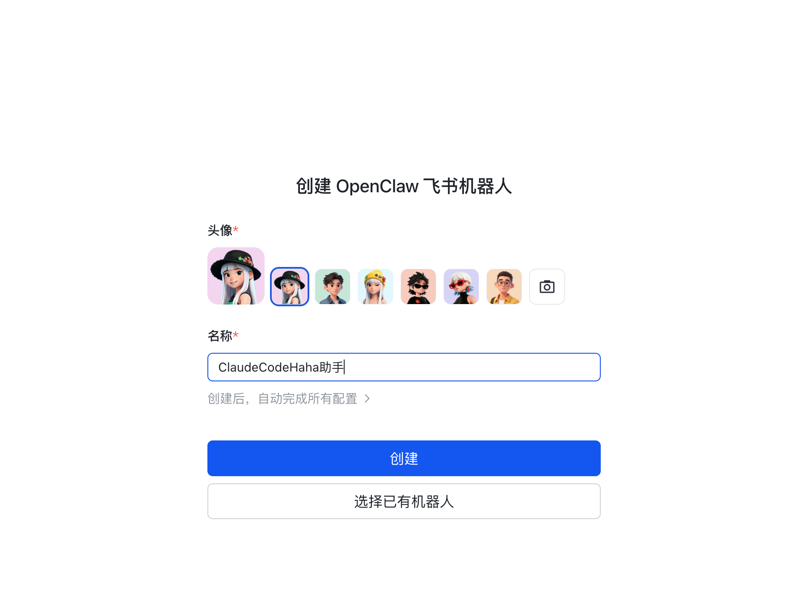

给机器人取个名字，点创建。

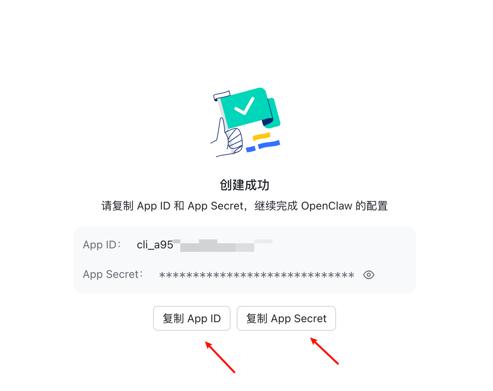

创建成功后把**App ID**和**App Secret**留着，下一步要填进桌面端。

## 配置机器人菜单

这一步可选，但配了之后在飞书里就能点按钮切项目、开新会话，不用手打命令。

进入[飞书开放平台](https://open.feishu.cn/app?lang=zh-CN)，选中刚创建的机器人。

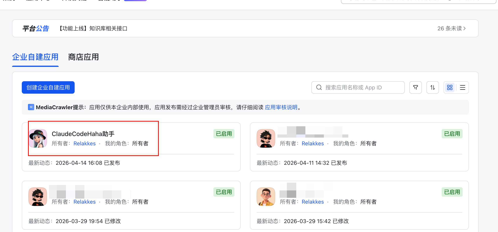

打开「机器人菜单」。

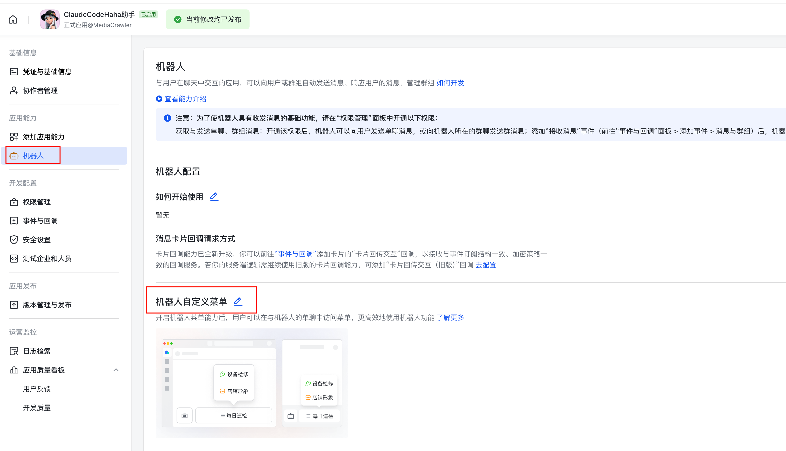

依次添加三个命令，每个都是一样的填法：菜单名称自定，命令填下面的值。

- `/projects` — 列出最近项目并切换
- `/new` — 开一条新会话
- `/clear` — 清空当前上下文

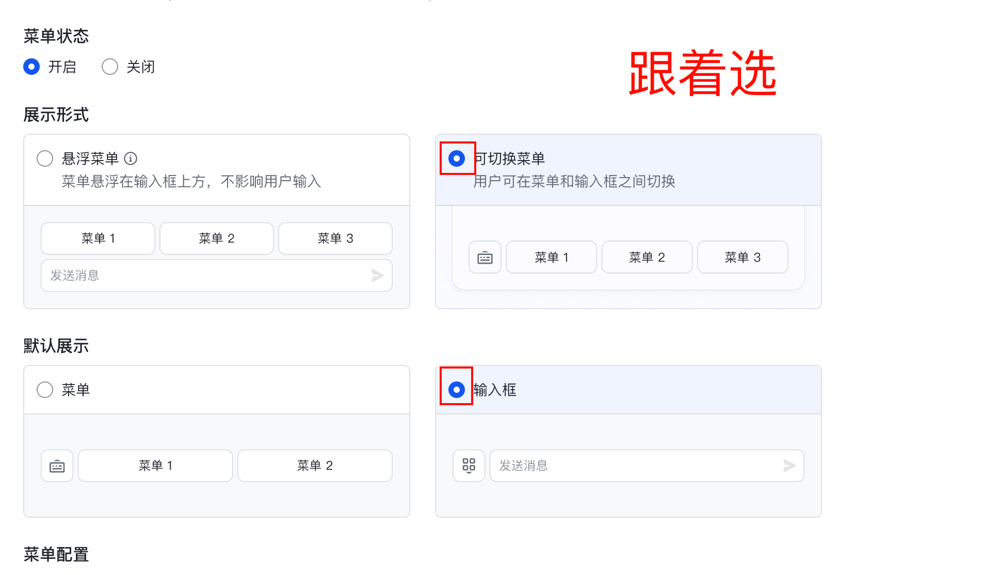

三个都加完后保存。

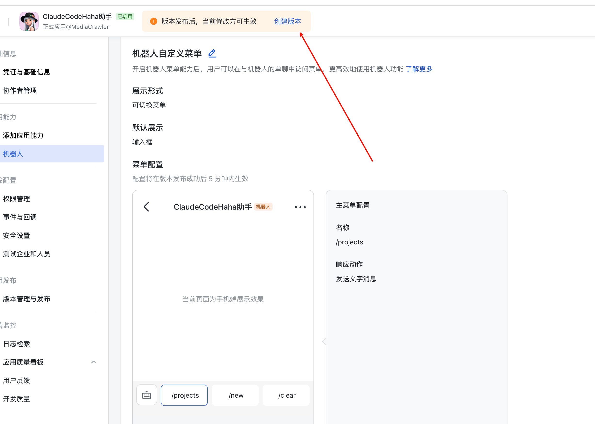

菜单只有发布后才生效，点「创建新版本并发布」。

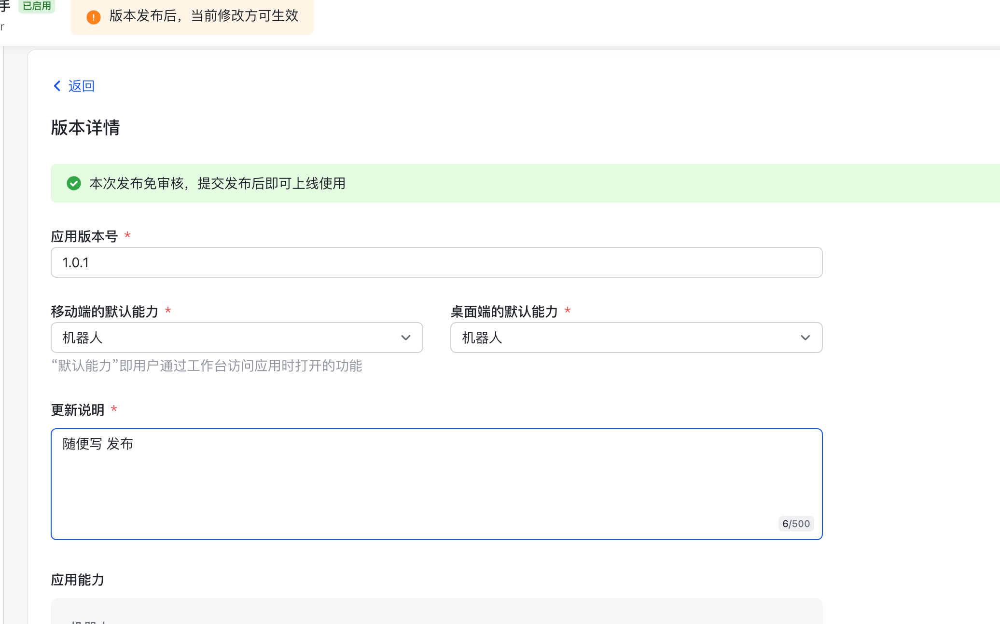

## 手动填凭据

扫码创建的机器人不需要这一步——凭据已经写好了。只有用模板手动创建、或者要复用已有机器人时才需要：

1. 打开「设置」→「IM 接入」，切到「飞书」Tab。
2. 把 App ID 和 App Secret 填进「App ID」和「App Secret」。
3. 「Encrypt Key」和「Verification Token」留空即可，长连接模式不需要。
4. 需要长时间流式更新同一张卡片时，勾上「流式卡片模式」。
5. 点「保存」。

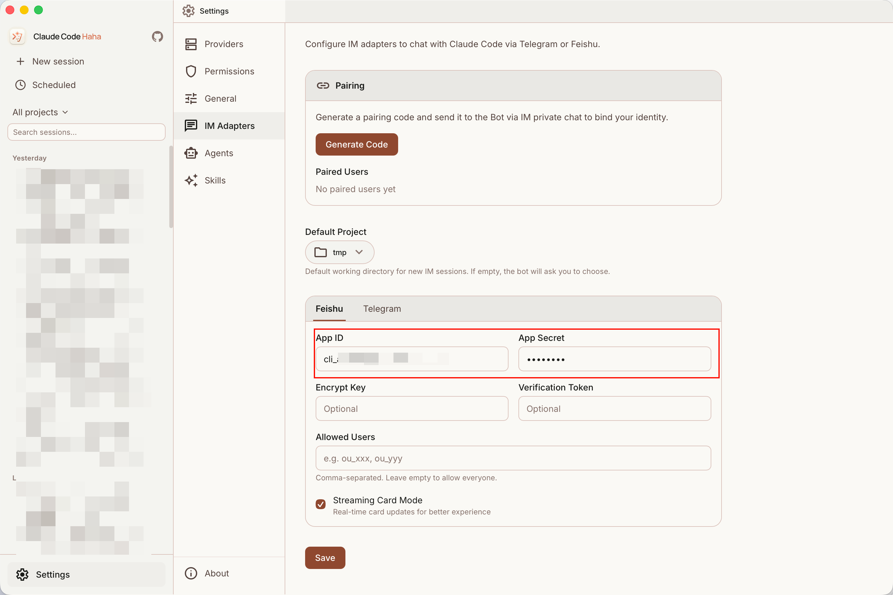

「允许的用户」可以留空。留空时只有完成配对的人能用，这通常就是你想要的。

## 配对

回到页面顶部的「配对管理」，点「生成配对码」，会出现一枚 6 位码。这一步会立即写入本机配置，不需要再点保存。

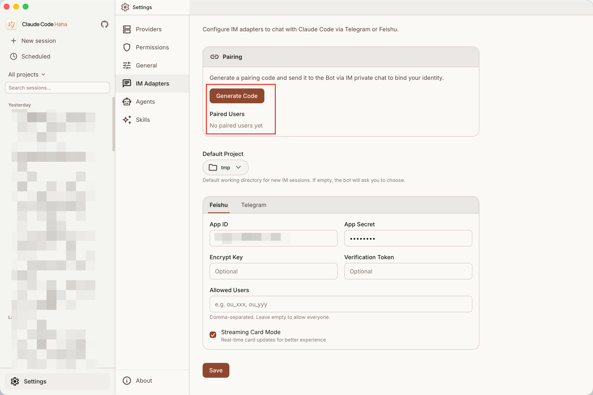

在飞书里私聊刚创建的机器人，随便发一条消息，按提示把这枚码发过去。

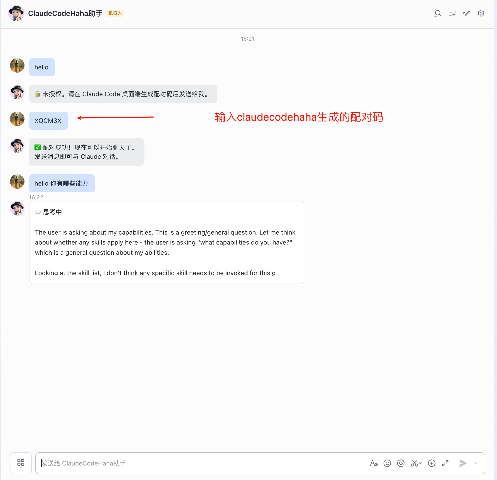

看到配对成功提示，就可以直接对话了。

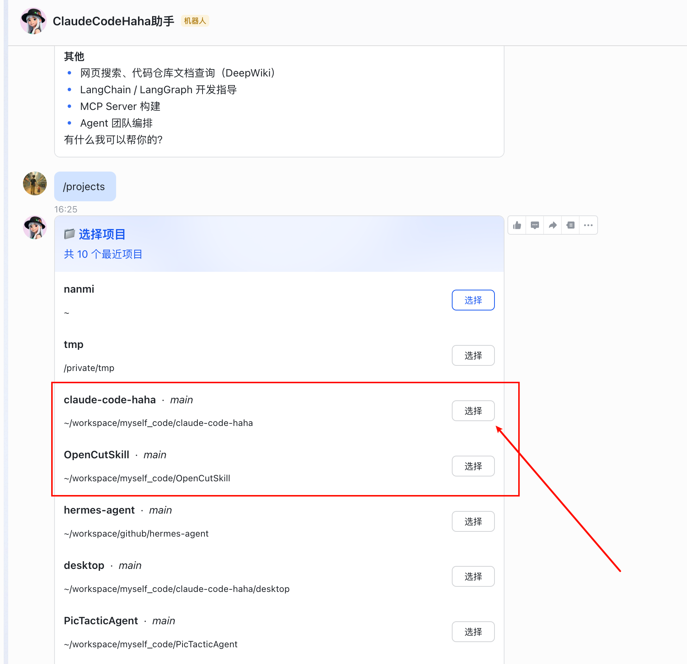

配对码 60 分钟内有效、只能用一次，重新生成后旧码立刻作废。

## 支持的命令

除菜单按钮外，聊天框里随时可以打：

- `/help` 或 `帮助`
- `/status` 或 `状态`
- `/projects` 或 `项目列表`
- `/new` 或 `新会话`
- `/clear` 或 `清空`
- `/stop` 或 `停止`

## 权限审批与消息表现

Claude 请求敏感权限时，飞书里会收到一张交互卡片，点「允许」或「拒绝」，结果直接回传给桌面端会话。

普通回复走飞书的富文本消息，流式内容优先原地更新同一条消息，完成后过长的正文会自动分片发送。

## 本地开发启动

发布版桌面端会自动把 adapter 作为 sidecar 拉起。只有从源码运行或单独调试时才需要手动启动：

```bash
cd adapters
bun install
bun run feishu
```

可选的环境变量覆盖：

```bash
export FEISHU_APP_ID="cli_xxx"
export FEISHU_APP_SECRET="xxx"
export ADAPTER_SERVER_URL="ws://127.0.0.1:3456"
```

## 常见问题

**二维码扫了没反应**：扫码走 `accounts.feishu.cn`，确认本机能访问。国际版租户（Lark）在确认后会自动切到 `accounts.larksuite.com` 完成，不用手动切换。

**扫完提示已过期**：二维码 10 分钟有效，点「重新扫码」再生成一张。

**收不到消息**：确认机器人已发布（改过菜单要重新「创建新版本并发布」），以及聊天窗口是和机器人的单聊而不是群。

**权限卡片点了没反应**：一般是卡片回调能力没随版本发布，回开放平台重新发一次版本。

**一直提示未授权**：检查配对码是否还在 60 分钟有效期内、发的是不是当前这一枚（重新生成后旧码失效），以及这个飞书账号是否已经出现在桌面端的「已配对用户」列表里。

**重启后会话没接回来**：检查 `~/.claude/adapter-sessions.json` 能否正常写入，以及桌面端里那条会话是否还在。

## 源码入口

`adapters/feishu/index.ts`（运行时）、`adapters/feishu/registration.ts`（扫码创建），以及 `adapters/common/` 下的 `pairing.ts`、`session-store.ts`、`ws-bridge.ts`、`http-client.ts`。
